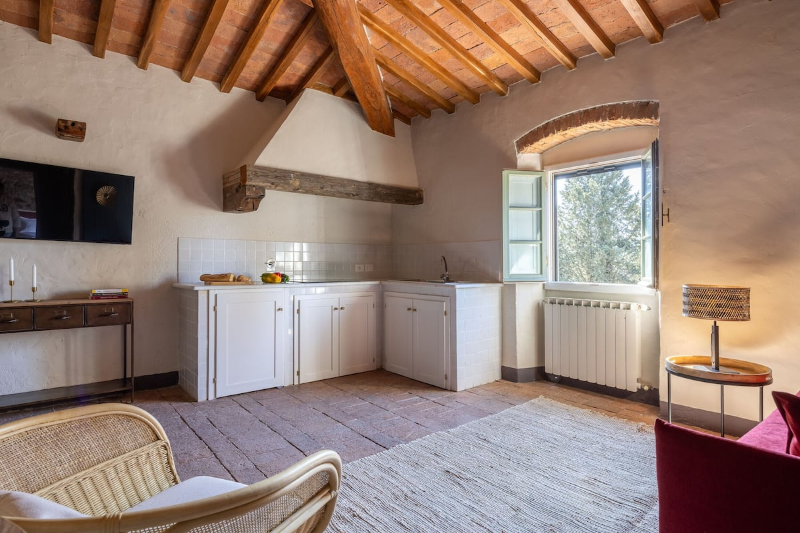
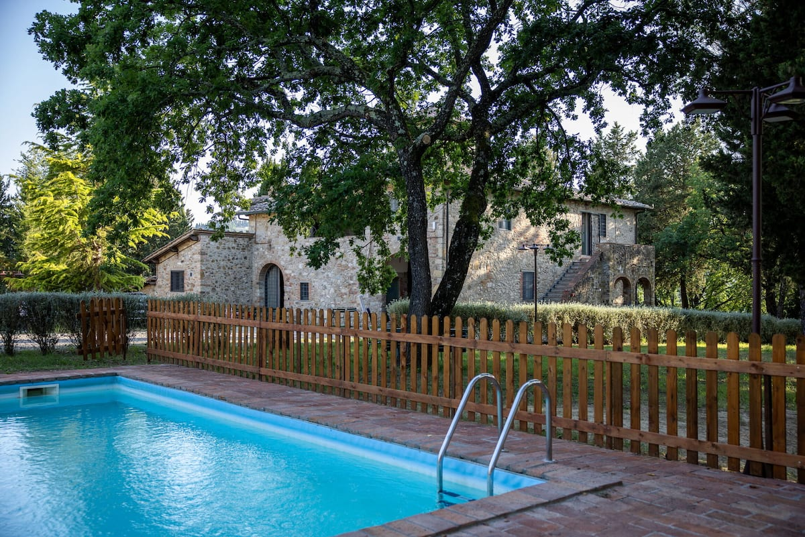
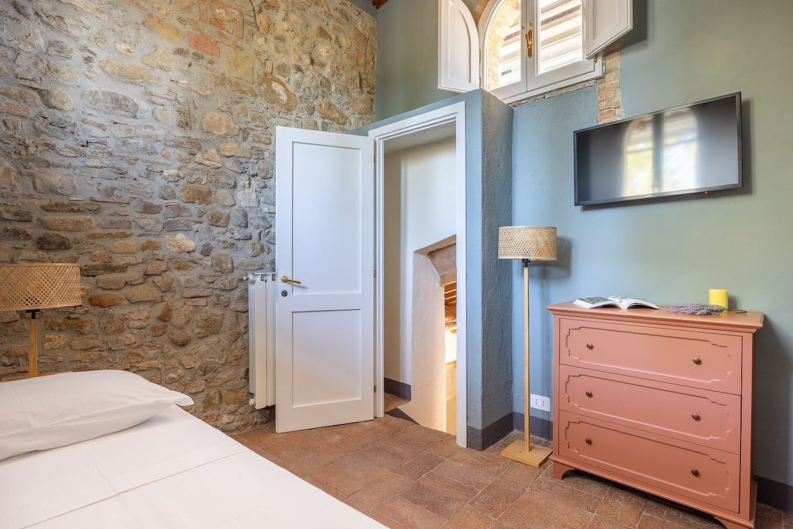
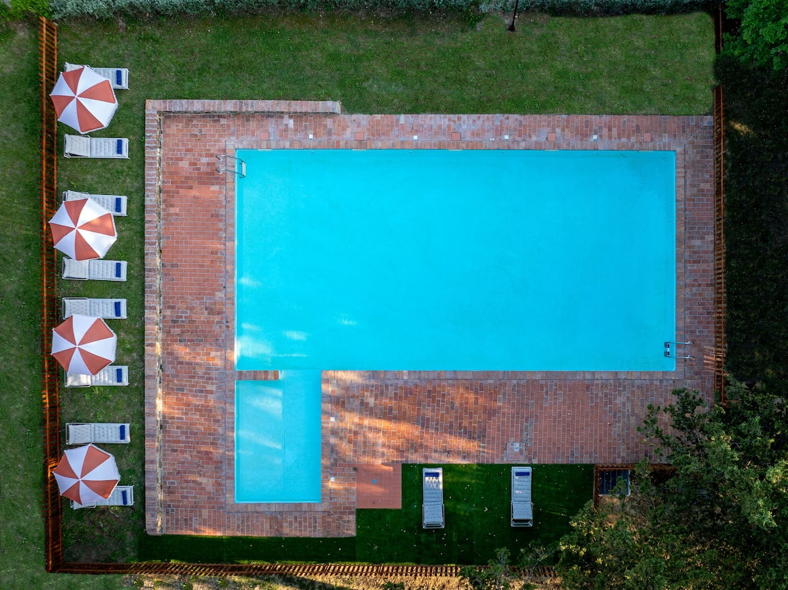

# Locations — Master List

Single source of truth. Michael sends locations/updates; I log them here, structured, and mark them on the map. Send anything: a name, a Google Maps link, "lat, lng", or a listing URL.

**Map:** until the visual map is rebuilt, every pin has a Google Maps link. Once there are a few, I'll render them together on one structured map.

---

## 🏠 Potential places to stay (living)

### Base 2 — longer stay (6+ nights)

#### 1. Ciliegiolo — Badia a Passignano (Airbnb)
- **Status:** Candidate (first one in)
- **For:** the longer/second base, 6+ nights
- **Dates checked:** 27 Aug → 2 Sep 2026 (6 nights), 4 guests
- **Location:** Badia a Passignano, Barberino Tavarnelle, **Chianti, Tuscany** 🇮🇹
- **Coordinates:** `43.5746, 11.2186` (approx, per Airbnb)
- **📍 Map:** https://www.google.com/maps/search/?api=1&query=43.5746,11.2186
- **Type:** Rental unit / apartment · **New listing (no reviews yet)**
- **Sleeps:** 4 guests · **2 bedrooms · 3 beds · 2 private bathrooms**
- **Price:** ⚠️ not available — Airbnb loads the price client-side, so it can't be scraped from the page. **Please paste the total it shows you for 27 Aug–2 Sep, 4 guests** and I'll log it + work out per-person.
- **Listing:** https://www.airbnb.com/rooms/1668821830585037471
- **Photos:** 14 saved in [`images/stay-badia-passignano/`](images/stay-badia-passignano/) (`photo-01.jpg` … `photo-14.jpg`)

**Area research (Chianti):** Badia a Passignano is a Vallombrosan abbey + the Antinori winery, set in Chianti Classico vineyards. Nearest towns: Tavarnelle Val di Pesa and San Donato in Poggio (~10 min). Drive times: **Florence ~40 min, Siena ~45 min, San Gimignano ~35 min, Greve in Chianti ~25 min.** Wine country, rolling hills, very photogenic.

**⚠️ Heads-up to confirm:** this is **inland Chianti**, not coastal. Nearest sea (Versilia coast / Viareggio) is **~1h30**, Cinque Terre **~2h**. The trip's original hard rule was "close to the sea / ≤15 min to a beach." A Chianti base is gorgeous but is a different kind of trip (wine + hilltowns, not beach). Tell me if the plan has shifted to a Tuscany-countryside trip, or if this is a "wow countryside villa, beach is secondary" call. Either is fine, I just want the structure honest.

_Photos preview:_

---

## 🗺️ All pins (quick table)
| # | Name | Category | Coordinates | Map |
|---|------|----------|-------------|-----|
| 1 | Ciliegiolo – Badia a Passignano | Stay · Base 2 | 43.5746, 11.2186 | [open](https://www.google.com/maps/search/?api=1&query=43.5746,11.2186) |

---

## 📝 Open notes / updates from Michael
- 2026-06-15: First location sent — Airbnb in Badia a Passignano (Chianti) as the longer/second base, 6+ nights. We start somewhere else first (Base 1 TBD).
- _Pending from Michael:_ the price for this listing (27 Aug–2 Sep, 4 guests).
